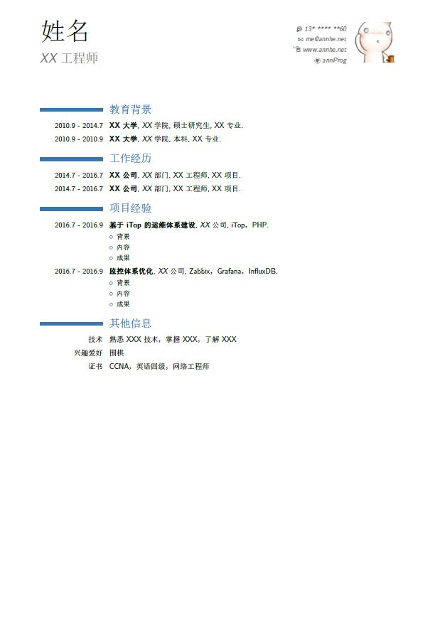
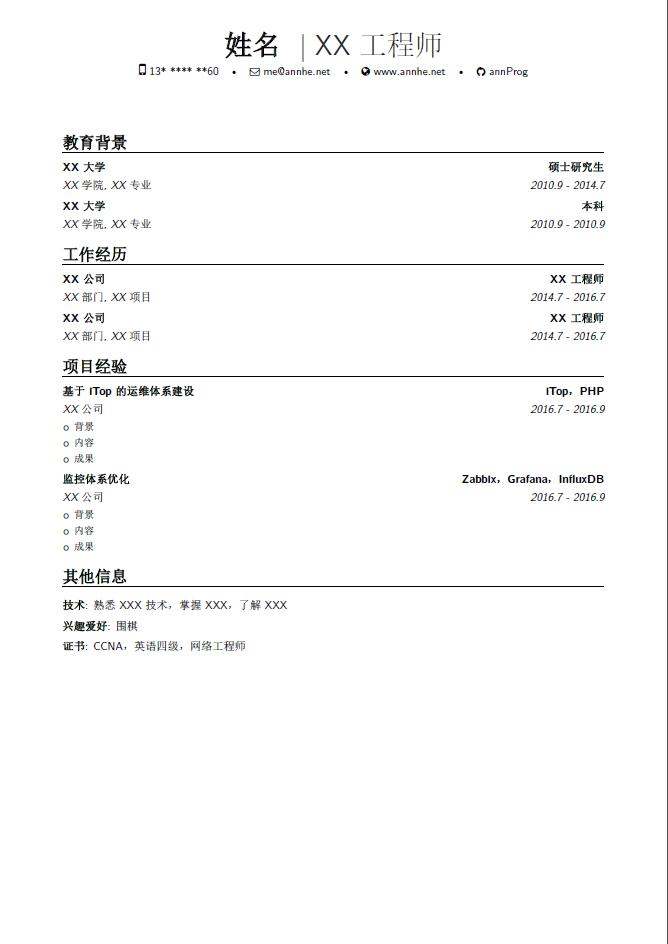
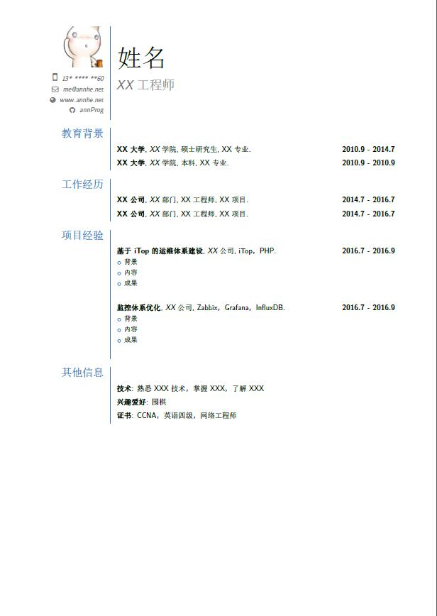
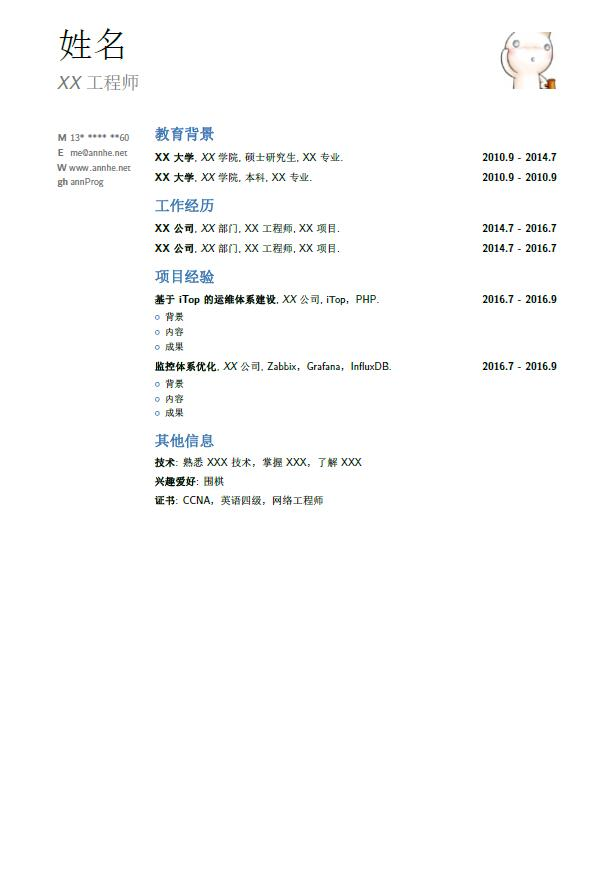

# Resume templates

## Requires
1. LaTeX(texlive) with moderncv
2. pandoc
3. shyaml

Windows上可以使用`msys2`搭建环境

## Usage

生成所有简历
```
make
```

按需生成简历
```
PHONE=111 GITHUB=xxx HOMEPAGE=xxx EMAIL=xxx TPL=moderncv.tpl COLOR=blue YAML=xxx.yml make
```

## 预览

### moderncv
classic



banking



fancy



oldstyle


